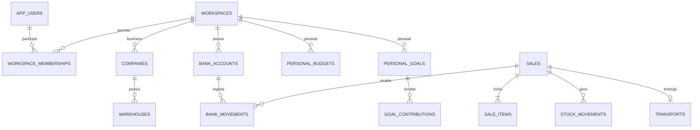

# Base de dados futura do MyOffice

Estado: **esquema PostgreSQL guardado e testado localmente, sem ligação à aplicação**. O front-end continua a usar `localStorage`. Nenhuma conta, serviço remoto, credencial ou assinatura foi criada. O esquema é independente do fornecedor; PostgreSQL alojado pelo próprio utilizador ou um serviço compatível podem ser avaliados mais tarde.

## Organização

Um utilizador pode pertencer a vários espaços (`workspaces`). Cada espaço é **personal** ou **business**. Um espaço Business representa um grupo e contém várias empresas; as empresas possuem armazéns e contas. Um espaço pessoal contém contas da casa, categorias, orçamentos, mensalidades e objetivos. Alternar o modo no futuro selecionará um espaço e as suas permissões; não converterá uma empresa em família nem misturará os saldos.



`migrations/001_initial.sql` cria 36 tabelas, quatro vistas de consulta e as restrições de integridade. Usa PostgreSQL 15+ por `UNIQUE NULLS NOT DISTINCT` e vistas com `security_invoker`.

- **Identidade e espaços**: utilizadores, membros, empresas, preferências de utilizador e do espaço. IDs de autenticação são referências ao futuro fornecedor, nunca palavras-passe.
- **Business**: armazéns, contactos, produtos/variações, configurações de estoque, compras/fontes, vendas/itens, transportes, defeituosos, rascunhos e simulações de importação.
- **Finanças partilhadas**: contas, lançamentos, dívidas, pagamentos e acréscimos. Uma conta Business exige empresa; uma conta pessoal não pode pertencer a empresa.
- **Pessoal**: categorias, orçamentos por período, contas recorrentes, objetivos e contribuições. As telas Home estão implementadas com persistência local; a conexão continua adiada.
- **Organização e auditoria**: agendas, eventos, notificações e eventos de auditoria.

## Garantias presentes no esquema

Os IDs são `text` para conservar os IDs antigos e os novos IDs com prefixo/UUID. Todos os vínculos de domínio incluem `workspace_id`; vendas têm também vínculos compostos para exigir armazém e banco da mesma empresa e moeda da conta. Produtos podem ser partilhados entre empresas do mesmo grupo, como no modelo atual.

Montantes usam `numeric`, quantidades admitem frações e os campos rejeitam valores inválidos. Saldo de conta, estoque e dívida são consultas derivadas, não campos de saldo editáveis. O saldo de conta não faz conversões cambiais implícitas.

O financeiro é **append-only**: UPDATE, DELETE e TRUNCATE de lançamentos são bloqueados por triggers; um estorno conserva a conta, os vínculos e o efeito contrário do original. Só pode existir um estorno por lançamento. Pagamentos e acréscimos de dívidas são preservados. Movimentações de estoque não podem ser apagadas/requantificadas; admitem apenas a atualização dos campos de remoção/restauro com justificativa.

As tabelas têm Row Level Security ativada **sem políticas de acesso concedidas**. Isto significa bloqueio por defeito para papéis não proprietários; não constitui login implementado. O futuro serviço deve usar papéis limitados e políticas verificadas, nunca dar ao navegador credenciais de proprietário. O proprietário PostgreSQL pode alterar o esquema; triggers não protegem contra administração privilegiada.

## Aplicação futura da migração

Não executar no front-end nem numa base com dados existentes. Numa base PostgreSQL 15+ vazia, escolhida futuramente, executar com `psql` já autenticado pelo mecanismo seguro do ambiente:

```sh
cd /workspace/MyOffice
psql --set ON_ERROR_STOP=1 --file database/migrations/001_initial.sql
```

O script usa uma transação e cria o schema `myoffice`. Deve ser aplicado **uma vez** numa base vazia; as próximas alterações serão novas migrações numeradas. A ligação a um servidor, papéis, autenticação, políticas, backups e endpoints continuam pendentes para a fase de backend.

## Migração dos dados atuais

Antes de importar, exportar uma cópia completa dos dados locais e validar num ambiente de ensaio. O importador ainda não foi implementado.

| Coleção local (`myoffice_estoque_*`, salvo indicação) | Destino |
|---|---|
| companies / warehouses / banks | companies / warehouses / bank_accounts |
| products e variations | products / product_variations |
| stockConfigs / movements / defective | stock_configs / stock_movements / defective_records |
| suppliers / employees / clients | contacts, com tipo e campos específicos em details |
| purchaseGroups / purchaseLists / purchaseSources | purchase_groups / purchase_lists / purchase_sources |
| sales e items / transports | sales / sale_items / transports |
| bankMovements | bank_movements |
| debts e increments / debtPayments | debts / debt_increments / debt_payments |
| productDrafts / agendas / manualEvents / notifications | product_drafts / agendas / calendar_events / notifications |
| categories / autoEventStatusOverrides | workspace_preferences.details |
| myoffice_import_simulations_v2_multicurrency / myoffice_import_thresholds_v1 | import_simulations / import_thresholds |
| myoffice_theme | user_preferences.theme |

Mapear `Kz`/`AOA` para `AOA` e `ativa`/`ativo` das contas para `ativo`, sem converter valores monetários. Acrescentar `workspace_id` explicitamente. Mapear todos os campos camelCase para snake_case. `details`/`snapshot` preservam os campos atuais ainda sem coluna específica, incluindo imagens, notas, contactos e taxas/proveniência das simulações.

Conservar os IDs e detetar duplicados antes de importar: não corrigir referências automaticamente por posição ou nome. Remoções financeiras antigas devem ser convertidas em original + compensação, como a migração local atual. `isReversed` é derivado da existência de `reversal_of_id`, sem excluir o original do saldo. Os IDs dos pagamentos e as relações com movimentos devem ser importados conjuntamente. Agendas automáticas continuam a derivar aniversários/entregas; overrides ficam nas preferências.

## Trabalho necessário antes da conexão

A estrutura SQL não substitui o backend. A próxima fase deve implementar autenticação e autorização por espaço/empresa, importador, endpoints e operações transacionais. Uma venda deverá validar estado das empresas/contas, produto e variação, estoque e valores; bloquear concorrência; e gravar venda, itens, saídas de estoque, entrada financeira e entrega **na mesma transação**. Pagamentos deverão validar moeda, conta, saldo devedor e vínculos. Transferências entre contas deverão gerar duas pernas ligadas e estorná-las em conjunto. Transferências entre pessoal e Business exigem registos e classificação em ambos os espaços.

O arredondamento dos itens SQL é a duas casas; validar e reconciliar os números JavaScript antigos na importação. É necessário conferir totais de vendas, estoque, dívidas e caixa antes de concluir a migração. Requisitos fiscais/contabilísticos, políticas de retenção e integração AGT continuam a confirmar; este esquema não declara conformidade fiscal.

## Validação offline

`tests/database-regression.mjs` aplica a migração em PostgreSQL local embutido (PGlite), sem ligar a um servidor externo. Verifica criação/RLS, separação dos espaços, quantidades/preços, referências, estornos, bloqueio de alteração do histórico e planeamento pessoal. Instruções de ferramentas de teste em `docs/DEVELOPMENT.md`.

## Extensão offline 002

Depois de `001_initial.sql`, aplicar `002_categories_and_home_shopping.sql` na futura migração: categorias/subcategorias Business com vínculo de produto, subcategorias pessoais e lista de compras com referência financeira. Total: 40 tabelas com RLS habilitada. Dois níveis explícitos impedem ciclos; FKs compostas impedem misturar espaços ou subcategorias de outra categoria. Nenhuma migração é executada pelo frontend.

Mapear `Product.category/subcategory` e os nomes locais para IDs; preservar campos de `details` existentes. Mapear `HomeData.shopping` para `personal_shopping_items` e `entryId` para o lançamento. A futura API terá de validar tipo/valor do pagamento e aplicar autenticação/RLS antes da conexão. Teste adicional: `MYOFFICE_PGLITE_MODULE=/caminho/pglite/dist/index.js node --test tests/categories-database-regression.mjs`.

## Extensão offline 003

Aplicar `003_home_goal_funding.sql` após 001/002 na futura base. Prepara `funding_mode`, progresso planeado, aquisição e referência de categoria; mantém 40 tabelas. Legado reserva preservado; novas metas deverão usar explicitamente a preferência do utilizador, planeamento por padrão. Aquisição/estorno exigem validação transacional no backend.

Mapear `HomeEntry.businessMovementId` / `BankMovement.homeTransferId` para as duas pernas do ledger e um `transfer_group_id` comum; preservar personalAccountId/personalCurrency em `import_details`. Saldo não partilhado. Verificar moeda/valor/permissões e criar/estornar em conjunto. Teste offline: `MYOFFICE_PGLITE_MODULE=/caminho/pglite/dist/index.js node --test tests/home-finance-database-regression.mjs`.

## Extensão offline 004

Aplicar `004_home_category_metadata.sql` após 001–003 quando houver backend: icon/edited_at/legacy_key em categorias e subcategorias pessoais; índice de nomes das subcategorias passa a não único, permitindo duplicados explicitamente confirmados com IDs independentes. Business mantém regras atuais. Categorias não utilizadas podem ser eliminadas; FKs preservam vínculos. Reclassificação futura de um ledger imutável deverá usar uma camada auditada de classificações, sem reescrever valores financeiros. Teste offline em tests/home-category-database-regression.mjs; mantém 40 tabelas/RLS. Nenhuma migração executada pelo frontend.

## Migração 005 — contas recorrentes e câmbio Home

Aplicar depois de 001–004 quando existir backend. Acrescenta ocorrências únicas conta/data e programação, tipo rendimento/despesa, moeda original/taxa e carteira de origem da meta; total de 41 tabelas. RLS ativada na nova tabela; autenticação/políticas continuam para a fase backend. A moeda do lançamento é a da carteira contabilizada; o original USD não é substituído. Preferências default de Home: reserveGoals=true e accountingMode=ask, guardar em workspace_preferences. Preservar escolhas antigas explicitamente guardadas.

Teste offline: `MYOFFICE_PGLITE_MODULE=/caminho/pglite/dist/index.js node --test tests/home-recurring-database-regression.mjs`. A aplicação frontend não executa SQL. O importador/overlays versionados para edição pessoal e scheduler servidor ainda não existem.

## Migração 006 — ferramentas pessoais

Aplicar depois de 001–005 apenas na futura base. Sete tabelas adicionais (**48 no total**): personal_debts, personal_debt_payments, personal_plans, personal_statement_rows, personal_documents, personal_entity_revisions e personal_task_completions. calendar_events recebe hora/prioridade/responsável/repetição/auditoria. As novas tabelas têm RLS habilitada, sem políticas de acesso configuradas nesta etapa.

| Campo local | Destino futuro |
|---|---|
| debts/debtPayments | personal_debts/personal_debt_payments; movimentos vinculados classificados como amortização |
| plans | personal_plans, mapear categorias para IDs e validar moeda da meta |
| statementRows | personal_statement_rows; fingerprint_sha256 = SHA-256 UTF-8 do fingerprint local completo, incluindo ordinal |
| documents | personal_documents; decodificar base64, validar e enviar ficheiro para armazenamento privado; guardar object_key, não binário/public URL |
| edits/deletedAt | personal_entity_revisions e metadados; snapshots sem content; overlays/compensação auditados no ledger |
| tasks/completedDates | calendar_events/personal_task_completions, uma conclusão por data |

Pagamento deve verificar saldo/restante, direção/valor/data/moeda do movimento e dívida dentro da mesma transação; valores de dívida/contas não são inferidos apenas por FKs. Conferência exige data/valor/carteira reais e representação das duas pernas de transferências. Associação polimórfica de documentos exige validação da entidade e do workspace pela API. Regras de repetição, saldo e recuperação precisam de transações/locks e autorização no backend. Não alterar bank_movements Business imutáveis. O frontend não executa SQL e não tem importador remoto.

Teste: `MYOFFICE_PGLITE_MODULE=/caminho/pglite/dist/index.js node --test tests/home-tools-database-regression.mjs`. O teste aplica as seis migrações e verifica separação, vínculos/moedas, metadados de ficheiros, revisões imutáveis e RLS habilitada.

## Migração 007 — documentos e orçamento Business

Depois de 001–006, prepara três tabelas empresariais, totalizando 51: business_budgets (empresa/categoria/mês/moeda), business_documents (objeto privado/hash/vínculo ao ledger) e business_receipt_links (identidade/ref/conta/data, append-only). A API futura valida estado/empresa proprietária, moeda, valor/data/sentido do movimento e saldo numa transação. RLS está habilitada, sem políticas de acesso definidas; frontend não executa SQL.

Mapear `myoffice-business-documents-v1` para essas tabelas. Gerar IDs dos links ao migrar; calcular SHA-256 de originais existentes. No Home, receiptReference/receiptFileHash podem ir em bank_movements.import_details na criação ou overlay de metadados auditado para movimentos antigos, preservando imutabilidade. Nunca enviar o base64 para campos de metadados remotos.

Teste: `MYOFFICE_PGLITE_MODULE=... node --test tests/business-document-database-regression.mjs tests/home-tools-database-regression.mjs` verifica duplicados, FKs/isolamento, imutabilidade e 51 tabelas com RLS.
