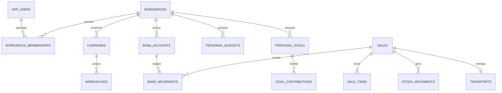

# Base de dados futura do MyOffice

Estado: **esquema PostgreSQL guardado e testado localmente, sem ligação à aplicação**. O front-end continua a usar `localStorage`. Nenhuma conta, serviço remoto, credencial ou assinatura foi criada. O esquema é independente do fornecedor; PostgreSQL alojado pelo próprio utilizador ou um serviço compatível podem ser avaliados mais tarde.

## Organização

Um utilizador pode pertencer a vários espaços (`workspaces`). Cada espaço é **personal** ou **business**. Um espaço Business representa um grupo e contém várias empresas; as empresas possuem armazéns e contas. Um espaço pessoal contém contas da casa, categorias, orçamentos, mensalidades e objetivos. Alternar o modo no futuro selecionará um espaço e as suas permissões; não converterá uma empresa em família nem misturará os saldos.



`migrations/001_initial.sql` cria 36 tabelas, quatro vistas de consulta e as restrições de integridade. Usa PostgreSQL 15+ por `UNIQUE NULLS NOT DISTINCT` e vistas com `security_invoker`.

- **Identidade e espaços**: utilizadores, membros, empresas, preferências de utilizador e do espaço. IDs de autenticação são referências ao futuro fornecedor, nunca palavras-passe.
- **Business**: armazéns, contactos, produtos/variações, configurações de estoque, compras/fontes, vendas/itens, transportes, defeituosos, rascunhos e simulações de importação.
- **Finanças partilhadas**: contas, lançamentos, dívidas, pagamentos e acréscimos. Uma conta Business exige empresa; uma conta pessoal não pode pertencer a empresa.
- **Pessoal**: categorias, orçamentos por período, contas recorrentes, objetivos e contribuições. Estas estruturas estão preparadas; as telas pessoais ainda não foram implementadas.
- **Organização e auditoria**: agendas, eventos, notificações e eventos de auditoria.

## Garantias presentes no esquema

Os IDs são `text` para conservar os IDs antigos e os novos IDs com prefixo/UUID. Todos os vínculos de domínio incluem `workspace_id`; vendas têm também vínculos compostos para exigir armazém e banco da mesma empresa e moeda da conta. Produtos podem ser partilhados entre empresas do mesmo grupo, como no modelo atual.

Montantes usam `numeric`, quantidades admitem frações e os campos rejeitam valores inválidos. Saldo de conta, estoque e dívida são consultas derivadas, não campos de saldo editáveis. O saldo de conta não faz conversões cambiais implícitas.

O financeiro é **append-only**: UPDATE, DELETE e TRUNCATE de lançamentos são bloqueados por triggers; um estorno conserva a conta, os vínculos e o efeito contrário do original. Só pode existir um estorno por lançamento. Pagamentos e acréscimos de dívidas são preservados. Movimentações de estoque não podem ser apagadas/requantificadas; admitem apenas a atualização dos campos de remoção/restauro com justificativa.

As tabelas têm Row Level Security ativada **sem políticas de acesso concedidas**. Isto significa bloqueio por defeito para papéis não proprietários; não constitui login implementado. O futuro serviço deve usar papéis limitados e políticas verificadas, nunca dar ao navegador credenciais de proprietário. O proprietário PostgreSQL pode alterar o esquema; triggers não protegem contra administração privilegiada.

## Aplicação futura da migração

Não executar no front-end nem numa base com dados existentes. Numa base PostgreSQL 15+ vazia, escolhida futuramente, executar com `psql` já autenticado pelo mecanismo seguro do ambiente:

```sh
cd /workspace/MyOffice
psql --set ON_ERROR_STOP=1 --file database/migrations/001_initial.sql
```

O script usa uma transação e cria o schema `myoffice`. Deve ser aplicado **uma vez** numa base vazia; as próximas alterações serão novas migrações numeradas. A ligação a um servidor, papéis, autenticação, políticas, backups e endpoints continuam pendentes para a fase de backend.

## Migração dos dados atuais

Antes de importar, exportar uma cópia completa dos dados locais e validar num ambiente de ensaio. O importador ainda não foi implementado.

| Coleção local (`myoffice_estoque_*`, salvo indicação) | Destino |
|---|---|
| companies / warehouses / banks | companies / warehouses / bank_accounts |
| products e variations | products / product_variations |
| stockConfigs / movements / defective | stock_configs / stock_movements / defective_records |
| suppliers / employees / clients | contacts, com tipo e campos específicos em details |
| purchaseGroups / purchaseLists / purchaseSources | purchase_groups / purchase_lists / purchase_sources |
| sales e items / transports | sales / sale_items / transports |
| bankMovements | bank_movements |
| debts e increments / debtPayments | debts / debt_increments / debt_payments |
| productDrafts / agendas / manualEvents / notifications | product_drafts / agendas / calendar_events / notifications |
| categories / autoEventStatusOverrides | workspace_preferences.details |
| myoffice_import_simulations_v2_multicurrency / myoffice_import_thresholds_v1 | import_simulations / import_thresholds |
| myoffice_theme | user_preferences.theme |

Mapear `Kz`/`AOA` para `AOA` e `ativa`/`ativo` das contas para `ativo`, sem converter valores monetários. Acrescentar `workspace_id` explicitamente. Mapear todos os campos camelCase para snake_case. `details`/`snapshot` preservam os campos atuais ainda sem coluna específica, incluindo imagens, notas, contactos e taxas/proveniência das simulações.

Conservar os IDs e detetar duplicados antes de importar: não corrigir referências automaticamente por posição ou nome. Remoções financeiras antigas devem ser convertidas em original + compensação, como a migração local atual. `isReversed` é derivado da existência de `reversal_of_id`, sem excluir o original do saldo. Os IDs dos pagamentos e as relações com movimentos devem ser importados conjuntamente. Agendas automáticas continuam a derivar aniversários/entregas; overrides ficam nas preferências.

## Trabalho necessário antes da conexão

A estrutura SQL não substitui o backend. A próxima fase deve implementar autenticação e autorização por espaço/empresa, importador, endpoints e operações transacionais. Uma venda deverá validar estado das empresas/contas, produto e variação, estoque e valores; bloquear concorrência; e gravar venda, itens, saídas de estoque, entrada financeira e entrega **na mesma transação**. Pagamentos deverão validar moeda, conta, saldo devedor e vínculos. Transferências entre contas deverão gerar duas pernas ligadas e estorná-las em conjunto. Transferências entre pessoal e Business exigem registos e classificação em ambos os espaços.

O arredondamento dos itens SQL é a duas casas; validar e reconciliar os números JavaScript antigos na importação. É necessário conferir totais de vendas, estoque, dívidas e caixa antes de concluir a migração. Requisitos fiscais/contabilísticos, políticas de retenção e integração AGT continuam a confirmar; este esquema não declara conformidade fiscal.

## Validação offline

`tests/database-regression.mjs` aplica a migração em PostgreSQL local embutido (PGlite), sem ligar a um servidor externo. Verifica criação/RLS, separação dos espaços, quantidades/preços, referências, estornos, bloqueio de alteração do histórico e planeamento pessoal. Instruções de ferramentas de teste em `docs/DEVELOPMENT.md`.
