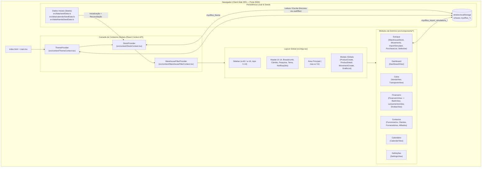

# Arquitetura do Sistema — MyOffice

Este documento descreve a **arquitetura real** implementada atualmente no repositório do **MyOffice**, verificada diretamente através de auditoria ao código-fonte.

---

## 1. Visão Geral Arquitetural

Atualmente, o **MyOffice** é uma **Single-Page Application (SPA) 100% Client-Side**, construída em **React 19** com **TypeScript**, empacotada pelo **Vite 6** e estilizada com **Tailwind CSS v4**.

- **Frontend**: SPA React estruturada por módulos de domínio (`src/components/<dominio>/`) e coordenada por um contentor de navegação central em `src/App.tsx`.
- **Backend**: **Não implementado atualmente.** Embora o `package.json` possua dependências instaladas do template base (`express`, `dotenv`, `@google/genai`, `tsx`), **não existe ficheiro `server.ts`** nem rotas `/api/*` ativas no código atual.
  - *Arquitetura futura de backend*: **A confirmar**.
- **Banco de Dados**: **Não existe banco de dados relacional ou NoSQL externo configurado atualmente.** Toda a persistência ocorre no navegador através de **`window.localStorage`**, inicializada a partir de dados de *seed* (`src/data/seedData.ts`, `src/data/calendarSeedData.ts`, `src/data/kiandaSeedData.ts`) e mantida íntegra por uma rotina de reconciliação automática no arranque.
  - *Banco de dados definitivo (ex.: PostgreSQL / Cloud SQL / Supabase / Firebase)*: **A confirmar**.
- **Autenticação e Autorização**: **Não existe ecrã de login ou sistema de autenticação externo ativo.** O sistema opera assumindo um perfil administrativo/operacional local, aplicando regras de permissão baseadas em regras de auditoria e no estado das empresas (`ativa`, `parada`, `desativada`).
  - *Sistema de autenticação multi-utilizador e RBAC*: **A confirmar**.

---

## 2. Diagrama de Arquitetura Atual



---

## 3. Camada de Estado Global (React Contexts)

A aplicação utiliza 3 provedores de contexto aninhados em `src/App.tsx` nesta ordem exata:

```tsx
<ThemeProvider>
  <StockProvider>
    <WarehouseFilterProvider>
      <AppContent />
    </WarehouseFilterProvider>
  </StockProvider>
</ThemeProvider>
```

### 3.1. `ThemeContext` (`src/context/ThemeContext.tsx`)
- Gere o modo visual (`'light' | 'dark' | 'system'`) e expõe `actualTheme` (`'light' | 'dark'`), `setTheme` e `toggleTheme`.
- Persiste a escolha em `localStorage` sob a chave `myoffice_theme`.
- Aplica ou remove a classe `.dark` e `style.colorScheme` diretamente no elemento `document.documentElement` (`<html>`), ativando os tokens CSS centralizados em `src/index.css`.

### 3.2. `StockContext` (`src/context/StockContext.tsx`)
É o **núcleo de domínio e persistência** de toda a aplicação (~3.100 linhas). Apesar do nome histórico `StockContext`, ele centraliza o estado e as operações de **todos os módulos operacionais**:
- **Empresas e Armazéns**: `companies`, `warehouses`, `stockConfigs`, `categories`, `isCompanyDisabled`, `isCompanyStopped`.
- **Produtos e Rascunhos**: `products`, `productDrafts`, cálculo de estoque em tempo real (`getCurrentStock`, `getProductStockInfo`, `getProductStockInfoForCompany`).
- **Movimentações de Estoque**: `movements`, `recordMovement`, `removeStockMovement` (*soft-delete* com auditoria), `restoreStockMovement`.
- **Defeituosos**: `defectiveRecords`, `recordDefective` (gera automaticamente movimento do tipo `'defeituoso'`), `updateDefectiveResolution`.
- **Compras**: `purchaseGroups`, `purchaseLists` (com itens e fontes/fornecedores alternativos).
- **Financeiro e Bancos**: `banks`, `bankMovements` (imutáveis, com suporte a estorno `reverseBankMovement`), `debts` (dívidas a receber/pagar, amortizações `registerDebtPayment` e incrementos `incrementDebtAmount`).
- **Caixa (Vendas e Transporte)**: `sales`, `completeSale` (orquestra venda + baixa de estoque + entrada financeira + criação de transporte + evento no calendário), `transports`, `updateTransportStatus`.
- **Contactos**: `suppliers`, `employees` (sincronizados automaticamente com a agenda de aniversários), `clients`.
- **Calendário**: `agendas` (manuais e automáticas), `events`.
- **Notificações**: `notifications`, `unreadNotificationsCount`, geração automática de alertas de estoque crítico, aniversários, entregas e auditoria de remoção.
- **Reset Controlado**: `resetHistoryOnly` (limpa histórico transacional mantendo cadastros) e `resetAllData` (restaura para os *seeds* de fábrica).

### 3.3. `WarehouseFilterContext` (`src/context/WarehouseFilterContext.tsx`)
- Mantém os filtros selecionados na vista **Estoque → Armazém** (`selectedCompanyIds`, `selectedWarehouseIds`, `selectedCategories`, `selectedStatuses`, `selectedConditions`, `hideZeroStock`, `stockLevelFilter`, `searchQuery`) persistentes em memória enquanto o utilizador navega entre outros módulos da aplicação.
- Exclui automaticamente empresas com `status === 'desativada'` e sincroniza a seleção de armazéns quando as empresas selecionadas mudam.

### 3.4. Estado Local do Simulador de Importação (`src/components/analytics/ImportSimulatorView.tsx`)
- O **Simulador de Importação e Rentabilidade** gere as suas próprias simulações guardadas e patamares de classificação (`thresholds`), persistindo-os diretamente em `localStorage` nas chaves:
  - `myoffice_import_simulations_v2_multicurrency`
  - `myoffice_import_thresholds_v1`

---

## 4. Navegação e Roteamento

- A aplicação **não utiliza `react-router-dom`** (não há roteamento por URL).
- O roteamento é controlado por estados em `src/App.tsx`:
  - `activeModule`: `'Dashboard' | 'Estoque' | 'Caixa' | 'Contactos' | 'Calendário' | 'Financeiro' | 'Banco' | 'Definições' | 'Agentes'`
  - `activeSubmodule` (Estoque): `'Armazém' | 'Movimentação' | 'Simulador de Importação e Rentabilidade' | 'Análise de produtos' | 'Lista de compras' | 'Defeituoso'`
  - `activeCaixaSubmodule`: `'Venda' | 'Transporte'`
  - `activeContactosSubmodule`: `'Funcionários' | 'Clientes' | 'Fornecedores' | 'Afiliados'`
  - `activeFinanceiroSubmodule`: `'Contas' | 'Lançamentos' | 'Dívidas'`
- **Navegação Cruzada com Filtro Contextual**:
  - `App.tsx` fornece callbacks (ex.: `onGoToTransport(saleId)`, `onGoToStockMovement(saleId)`, `onGoToFinancialEntry(saleId)`, `handleNavigateToModule`) que mudam o módulo/submódulo ativo e injetam `searchQuery` (`externalSearchQuery`) na vista de destino para filtrar automaticamente o registo pretendido (por exemplo, `VND-1001`).

---

## 5. Fluxo de Dados e Reconciliação no Arranque

Quando a aplicação arranca no navegador:

1. **Carregamento Inicial (`loadFromStorage`)**: `StockContext` lê cada coleção de `localStorage`.
2. **Injeção da Empresa Desativada (*Kianda*)**: Garante que os dados de *seed* da empresa desativada `comp-kianda` (`src/data/kiandaSeedData.ts`) existem nas coleções base para testar o isolamento de empresas desativadas.
3. **Migração e Normalização**:
   - Garante que todas as empresas possuem `status` (`'ativa' | 'parada' | 'desativada'`).
   - Sincroniza `INITIAL_SALES`, `INITIAL_MOVEMENTS`, `INITIAL_BANK_MOVEMENTS` e `INITIAL_TRANSPORTS` caso o `localStorage` do navegador tenha dados de versões anteriores sem os vínculos completos.
4. **Efeito de Reconciliação de Vendas (`useEffect` em `StockContext.tsx`)**:
   - Verifica todas as vendas concluídas (`sale.status === 'concluida'`) de empresas não desativadas.
   - Se faltar algum movimento de saída em `movements`, entrada financeira em `bankMovements` ou registo de entrega em `transports` (quando `sale.requiresTransport === true`), cria automaticamente o registo em falta com `saleId: sale.id` e `reference: sale.id`.
5. **Sincronização de Agendas Automáticas e Notificações**:
   - Gera/atualiza eventos de aniversário a partir de `employees` e eventos de entrega a partir de `transports`.
   - Gera alertas automáticos de estoque crítico/reposto e entregas próximas em `notifications`.
