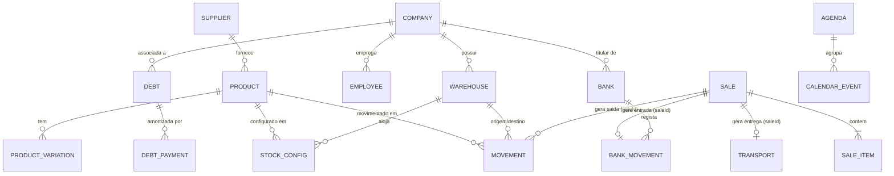

# Modelo de Dados e Persistência — MyOffice

Este documento descreve a estrutura de dados atual do **MyOffice**, as chaves de persistência em `window.localStorage` e as entidades definidas em `src/types/`.

---

## Estrutura futura guardada (2026-10-07)

O esquema PostgreSQL está em [`database/migrations/001_initial.sql`](../database/migrations/001_initial.sql), com documentação de aplicação/importação em [`database/README.md`](../database/README.md). Inclui espaços Pessoal e Business, multiempresa, contas/lançamentos, estoque/vendas e planeamento pessoal. Foi validado localmente, sem servidor remoto. **Não está ligado ao front-end**, não substitui o armazenamento atual e não implementa autenticação nem as telas pessoais.

## 1. Estado Atual do Banco de Dados

- **Banco de Dados Externo (SQL / NoSQL)**: **Não utilizado atualmente.**
  - *Tecnologia de base de dados para futura migração de produção*: **A confirmar**.
- **Mecanismo de Persistência Atual**: **`window.localStorage`** no navegador do cliente.
- **Dados Iniciais (*Seed Data*)**:
  - `src/data/seedData.ts`: Dados operacionais completos de 3 empresas ativas (`comp-1`, `comp-2`, `comp-3`), 3 armazéns (`wh-1`, `wh-2`, `wh-3`), 6 produtos, configurações de estoque, movimentações, vendas, transportes, bancos, movimentos bancários, dívidas, listas de compra, fornecedores, funcionários, clientes e notificações.
  - `src/data/kiandaSeedData.ts`: Dados da empresa desativada `comp-kianda` (*Kianda Comercial Lda*) para verificação contínua da regra de exclusão de empresas desativadas.
  - `src/data/calendarSeedData.ts`: Agendas iniciais (`agd-aniversarios`, `agd-entregas`, agendas manuais) e eventos de calendário.

---

## 2. Mapa de Chaves de `localStorage`

| Chave em `localStorage` | Ficheiro Gestor | Tipo TypeScript | Descrição |
| :--- | :--- | :--- | :--- |
| `myoffice_theme` | `ThemeContext.tsx` | `ThemeMode` (`'light' \| 'dark' \| 'system'`) | Preferência de tema visual |
| `myoffice_estoque_companies` | `StockContext.tsx` | `Company[]` | Empresas registadas e respetivo `status` |
| `myoffice_estoque_warehouses` | `StockContext.tsx` | `Warehouse[]` | Armazéns e lojas físicas |
| `myoffice_estoque_products` | `StockContext.tsx` | `Product[]` | Catálogo de produtos e variações |
| `myoffice_estoque_stockConfigs` | `StockContext.tsx` | `StockConfig[]` | Limites mín./máx. e localização por produto/armazém |
| `myoffice_estoque_movements` | `StockContext.tsx` | `Movement[]` | Histórico de movimentações (ativas e removidas) |
| `myoffice_estoque_defective` | `StockContext.tsx` | `DefectiveRecord[]` | Registos de produtos defeituosos |
| `myoffice_estoque_purchaseGroups` | `StockContext.tsx` | `PurchaseGroup[]` | Grupos de listas de compras |
| `myoffice_estoque_purchaseLists` | `StockContext.tsx` | `PurchaseList[]` | Listas de compras, itens e fontes de fornecedores |
| `myoffice_estoque_suppliers` | `StockContext.tsx` | `Supplier[]` | Fornecedores nacionais e internacionais |
| `myoffice_estoque_categories` | `StockContext.tsx` | `string[]` | Categorias de produtos |
| `myoffice_estoque_productDrafts` | `StockContext.tsx` | `ProductDraft[]` | Rascunhos de produtos em criação |
| `myoffice_estoque_banks` | `StockContext.tsx` | `Bank[]` | Contas bancárias e cofres |
| `myoffice_estoque_bankMovements` | `StockContext.tsx` | `BankMovement[]` | Lançamentos financeiros e estornos |
| `myoffice_estoque_debts` | `StockContext.tsx` | `Debt[]` | Dívidas a receber e a pagar + histórico de pagamentos |
| `myoffice_estoque_sales` | `StockContext.tsx` | `Sale[]` | Vendas realizadas no POS |
| `myoffice_estoque_transports` | `StockContext.tsx` | `Transport[]` | Entregas e transportes logísticos |
| `myoffice_estoque_agendas` | `StockContext.tsx` | `Agenda[]` | Agendas do calendário |
| `myoffice_estoque_manualEvents` | `StockContext.tsx` | `CalendarEvent[]` | Eventos manuais e automáticos |
| `myoffice_estoque_notifications` | `StockContext.tsx` | `NotificationItem[]` | Notificações do sistema |
| `myoffice_estoque_employees` | `StockContext.tsx` | `Employee[]` | Funcionários por empresa |
| `myoffice_estoque_clients` | `StockContext.tsx` | `Client[]` | Clientes registados |
| `myoffice_import_simulations_v2_multicurrency` | `ImportSimulatorView.tsx` | `ImportSimulation[]` | Simulações de importação guardadas |
| `myoffice_import_thresholds_v1` | `ImportSimulatorView.tsx` | `ClassificationThresholds` | Limiares de margem e ROI para classificação de viabilidade |

---

## 3. Diagrama de Entidades e Relacionamentos (ERD Lógico)

---

## 4. Principais Interfaces TypeScript (`src/types/`)

### 4.1. `Company` e `Warehouse` (`src/types/stock.ts`)
- `Company`: `id`, `name`, `nif`, `address`, `contact`, `currency` (`'Kz' | 'USD' | 'EUR'`), `status` (`'ativa' | 'desativada' | 'parada'`), `notes`.
- `Warehouse`: `id`, `name`, `type` (`'armazem' | 'loja_fisica'`), `address`, `manager`, `contact`, `companyId`, `observations`.

### 4.2. `Product` e `StockConfig` (`src/types/stock.ts`)
- `Product`: `id`, `name`, `sku`, `category`, `brand`, `supplierId`, `costPrice`, `salePrice`, `unitOfMeasure`, `condition`, `status`, `description`, `mainImage`, `gallery`, `variations` (`ProductVariation[]`), `createdAt`, `createdBy`.
- `StockConfig`: `productId`, `warehouseId`, `minLimit`, `maxLimit`, `physicalLocation`.

### 4.3. `Movement` (`src/types/stock.ts`)
- Campos principais: `id`, `productId`, `variationId?`, `warehouseId`, `destinationWarehouseId?`, `type` (`'entrada' | 'saida' | 'transferencia' | 'defeituoso' | 'ajuste'`), `quantity`, `date`, `responsible`, `reason`, `reference?`, `saleId?`.
- Campos de auditoria de remoção (*soft-delete*):
  - `removido?: boolean` e `isRemoved?: boolean`
  - `motivo_remocao?: string` e `removalReason?: string`
  - `removido_por?: string` e `removedBy?: string`
  - `data_remocao?: string` e `removedAt?: string`

### 4.4. `Sale` e `Transport` (`src/types/stock.ts`)
- `Sale`: `id` (ex.: `'VND-1001'`), `date`, `customerName`, `customerContact?`, `warehouseId`, `items` (`SaleItem[]`), `subtotal`, `discount`, `total`, `paymentMethod`, `bankId`, `requiresTransport`, `transportId?`, `status` (`'concluida' | 'pendente' | 'cancelada'`), `seller`, `notes?`.
- `Transport`: `id` (ex.: `'TRP-1001'`), `saleId?`, `customerName`, `customerContact`, `originWarehouseId`, `destinationAddress`, `driverName`, `driverContact`, `vehicleInfo`, `status` (`'pendente' | 'em_transito' | 'entregue' | 'atrasado' | 'cancelado'`), `priority` (`'baixa' | 'normal' | 'alta' | 'urgente'`), `scheduledDate`, `deliveredDate?`, `cost`, `trackingCode?`, `notes?`.

### Auditoria financeira atual

`BankMovement` inclui `isReversed`, `reversedAt`, `reversalReason`, `reversedBy` e `reversalOfId`. O lançamento de compensação aponta para o original. O saldo inclui os dois; pagamentos de dívida ligados a um original estornado deixam de liquidar a dívida, sem eliminar o histórico do pagamento. Campos antigos de remoção são mantidos como metadados de compatibilidade e convertidos ao carregar.

### 4.5. `Bank`, `BankMovement` e `Debt` (`src/types/stock.ts`)
- `Bank`: `id`, `name`, `code`, `accountNumber`, `iban`, `currency`, `balance`, `companyId`, `type` (`'banco' | 'caixa_fisico'`), `status`.
- `BankMovement`: `id`, `bankId`, `destinationBankId?`, `type` (`'entrada' | 'saida' | 'transferencia'`), `amount`, `date`, `category`, `description`, `reference?`, `responsible`, `saleId?`, `purchaseListId?`, `debtId?`, `isReversed?`, `reversedAt?`, `reversalReason?`, `reversedBy?`, `reversalOfId?`.
- `Debt`: `id`, `type` (`'receber' | 'pagar'`), `entityName`, `entityContact?`, `companyId`, `originalAmount`, `remainingAmount`, `currency`, `issueDate`, `dueDate`, `status` (`'pendente' | 'parcial' | 'paga' | 'vencida'`), `description`, `payments` (`DebtPayment[]`), `increments` (`DebtIncrement[]`).

## Documento pessoal Home

`myoffice-home-v1` guarda o documento validado de versão 1: nome da casa, contas/saldos iniciais, lançamentos/estornos/transferências, limites mensais, contas recorrentes, metas e tarefas. `myoffice-mode` guarda home/business. Ambas usam hífen para não participar do reset Business. Ver `src/types/home.ts`, `src/utils/home.ts` e `HOME.md`. Sem conexão remota; exportação/importação é JSON, não SQL.

## Categorias e compras (2026-10-08)

Business: `myoffice_estoque_subcategories` contém mapa categoria → nomes das subcategorias. `Product.subcategory`/`ProductDraft.subcategory` guardam a classificação; produtos antigos permanecem compatíveis. Home: o JSON v1 inclui categorias, mapa de subcategorias e itens de compras (`id`, `name`, `category`, `subcategory?`, `quantity`, `unitPrice`, `entryId?`, `archived`). Cópias sem esses campos são normalizadas. O vínculo ao pagamento exige despesa real, categoria/montante correspondentes e referência única. Migração SQL offline 002 prepara quatro tabelas adicionais e vínculos de produtos, totalizando 40 tabelas; nenhuma conexão é ativada.

## Extensão Home AOA/USD e metas (2026-10-08)

HomeData v1 mantém compatibilidade: contas/moedas, limites, mensalidades e compras têm moeda opcional (legado AOA); metas guardam fundingMode, plannedAmount, acquiredDate/acquisitionEntryId e categoria. settings guarda reserveGoals (padrão false), goalsPreferenceSet e showBusinessIncome. incomeCategories/incomeSubcategories separadas das despesas. Entradas guardam goalId/businessMovementId. BankMovement guarda homeTransferId/personalAccountId/personalCurrency. Diário transitório: myoffice-home-business-transaction; não é ledger nem conexão externa. Migração offline 003 acrescenta colunas de financiamento/aquisição, mantendo 40 tabelas.

## Catálogo Home estável — bloco 1 (09/10/2026)

HomeData v1 inclui categoryCatalog com id/key/name/kind/parentId/icon/editedAt. `key` preserva referências atuais; `name` pode mudar. Repetições confirmadas recebem IDs/chaves independentes. categories/subcategories e incomeCategories/incomeSubcategories são projeções compatíveis. categoryHistory preserva classificação anterior e data em entidades reclassificadas; HomeEntry.subcategory suporta o vínculo de compras. Migração local idempotente, sem mudar dinheiro. Migração SQL offline 004 guarda metadados e permite subcategorias pessoais homónimas; Business mantém unicidade. Nenhuma conexão ativa.

## HomeAudit — bloco 2 (09/10/2026)

Entidades pessoais incluem editedAt, deletedAt e edits (changedAt/before). Nenhuma remoção física de entidades financeiras; backups conservam dados/referências/versões. effectiveEntries ignora deletedAt; listas ignoram entidades pessoais eliminadas. Limites únicos só entre ativos. Compras incluem paymentAmount e paymentSnapshot, separando pago efetivo de quantidade/preço planeados. A futura base deverá mapear metadados de entidades para details e fornecer revisões/classificação auditadas para o ledger pessoal; não alterar diretamente o bank_movements SQL append-only. Nenhuma conexão/migração nova executada nesta entrega.
